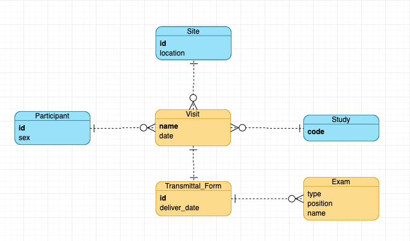

# WITS Technical Pretest

## Answers
1. Entity Relationship Diagram

2. Appendix example data XML file
https://github.com/fallingstar1204/WitsInterview/blob/master/src/main/resources/AppendixTransmittalForms.xml

3. InvestigationResult XML file
https://github.com/fallingstar1204/WitsInterview/blob/master/src/test/resources/InvestigationResults.xml

4. Bonus question
Please refer to doInvestigation(QueryParam queryParam) of InvestigationService.
Here is the link: https://github.com/fallingstar1204/WitsInterview/blob/master/src/main/java/com/wits/technical/pretest/demo/service/InvestigationService.java

## Questions

##### 1. Data issue - Are site id and participant id primary key?

In Transmittal form T1 and Transmittal form T5, 
    the site ids are the same, but the Location fields are different.
    the participant ids are the same case, too. 
 
##### 2. InvestigationResult generating logic

In question3, the question only says InvestigationResult should have following fields:
- Site ID
- Participant ID
- Visit Name
- Exam Type
- Exam Position
- Exam Name

A transmittal Form has many exams. Do I need to list all exams when generating InvestigationResult?
i.g. The answer to question3 is Transmittal Form T4 and it has two exams. So I generate two investigationResults.
Please refer to https://github.com/fallingstar1204/WitsInterview/blob/master/src/test/resources/InvestigationResults.xml